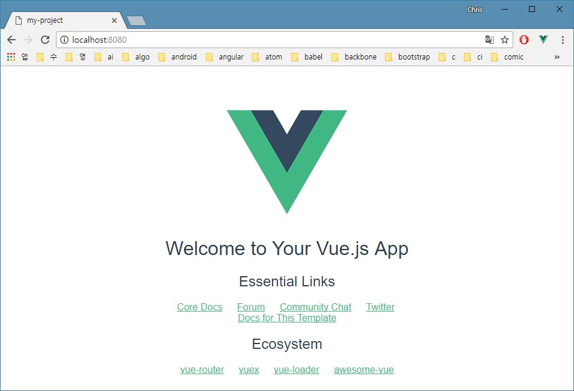
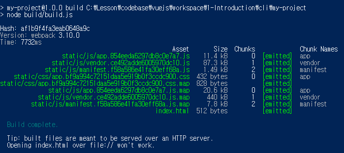

# Vue CLI

```
PS C:\Lesson\vuejs\cli> vue init webpack my-project

? Project name my-project
? Project description A Vue.js project
? Author Seokwon SONG <softcontext@gmail.com>
? Vue build standalone
? Install vue-router? No
? Use ESLint to lint your code? No
? Set up unit tests No
? Setup e2e tests with Nightwatch? No
? Should we run `npm install` for you after the project has been created? (recommended) no

   vue-cli · Generated "my-project".

# Project initialization finished!
# ========================

To get started:

  cd my-project
  npm run dev

Documentation can be found at https://vuejs-templates.github.io/webpack

PS C:\Lesson\vuejs\cli> cd my-project
PS C:\Lesson\vuejs\cli> npm i
PS C:\Lesson\vuejs\cli> npm run dev
```



`npm run dev`
컴파일, ESLint 과정을 거치고 로컬서버로 실행하고 브라우저를 띄워 첫 화면을 표시합니다.
접속주소는 디폴트로 `http://localhost:8080/` 입니다.
코드 수정후 저장하면 ESLint, hot-reload 가 동작(변경된 상태만 변경) 합니다.

`npm run build`
/dist 폴더에 Production 파일 생성합니다.
JavaScript(UglifyJS), HTML(html-minifier) 최소화 작업을 수행합니다.
하나의 CSS 파일로 최소화(cssnano) 합니다.



`npm run unit`
단위 테스트는 Karma + Mocha + karma-webpack 으로 PhantomJS에서 실행 됩니다.
/test/unit/specs 에 정의된 테스트 코드가 실행됩니다.

`npm run e2e`
end to end 테스트는 Nightwatch 로 실행됩니다.
Nightwatch.js 는 Selenium/WebDriver 서버에서 실행되는 Node.js 기반의 e2e 테스트 솔루션으로 /test/e2e/specs 에 정의된 테스트 코드가 실행됩니다.
Selenium server 는 Java 환경에서 실행되므로 최소 7버전 이상의 Java SE Development Kit이 필요합니다.
<br>

### Component Generator
https://www.npmjs.com/package/vue-generate-component
<br>

> Installation
`npm install -g vue-generate-component`

<br>

> Usage
`vgc --help`

<br>

#### Create Component's 5 Files
<br>

> Create new component
커서가 있는 위치에 컴포넌트 이름의 폴더를 만들고 하부로 파일 5개를 만든다.
`vgc footer`

<br>

footer.component.html

```html
<section class="footer">
  <h1>footer Component</h1>
</section>
```


footer.component.js

```JavaScript
export default {
  name: 'footer',
  components: {},
  props: [],
  data () {
    return {

    }
  },
  computed: {

  },
  mounted () {

  },
  methods: {

  }
}
```

footer.component.scss

```scss
.footer {

}
```

footer.component.spec.js

```JavaScript
import Vue from 'vue';
import FooterComponent from './index.vue';

// Here are some Jasmine 2.0 tests, though you can
// use any test runner / assertion library combo you prefer
describe('FooterComponent', () => {
  // Inspect the raw component options
  it('has a created hook', () => {
    // expect(typeof FooterComponent.created).toBe('function');
  })
  // Evaluate the results of functions in
  // the raw component options
  it('sets the correct default data', () => {
    // expect(typeof FooterComponent.data).toBe('function')
    // const defaultData = FooterComponent.data();
    // expect(defaultData.message).toBe('hello!');
  })
  // Inspect the component instance on mount
  it('correctly sets the message when created', () => {
    // const vm = new Vue(FooterComponent).$mount();
    // expect(vm.message).toBe('bye!');
  })
  // Mount an instance and inspect the render output
  it('renders the correct message', () => {
    // const Ctor = Vue.extend(FooterComponent);
    // const vm = new Ctor().$mount();
    // expect(vm.$el.textContent).toBe('bye!');
  })
})
```

index.vue

```html
<template src="./footer.component.html"></template>
<script src="./footer.component.js"></script>
<style src="./footer.component.scss" scoped lang="scss"></style>
```
<br>

#### Create Component's Single File
<br>

`vgc -s Hello`

Hello.vue

```html
<template lang="html">

  <section class="hello">
    <h1>hello Component</h1>
  </section>

</template>

<script lang="js">
  export default  {
    name: 'hello',
    props: [],
    mounted() {

    },
    data() {
      return {

      }
    },
    methods: {

    },
    computed: {

    }
}
</script>

<style scoped lang="scss">
  .hello {

  }
</style>
```

#### Create new component single file inside new folder

`vgc -s home --folder`

#### Create new directive

`vgc -d my-directive`

<br>

### SCSS Dependency

다음 코드의 lang="scss" 속성을 위해서 SCSS 디펜던시가 필요하다.

```html
<style scoped lang="scss">
  .hello {

  }
</style>
```

다음을 터미널을 열고 프로젝트 루트에서 실행한다.

`npm install --save-dev sass-loader`
`npm install --save-dev node-sass`
