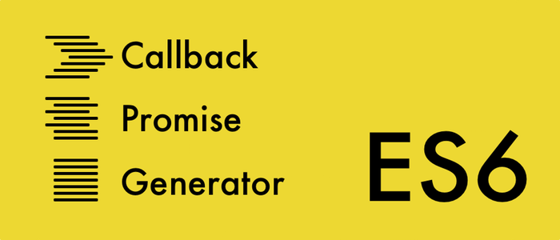

# ES6의 제너레이터를 사용한 비동기 프로그래밍

이 문서는 수업의 도움을 주고자 제공됩니다. 저작권은 다음 사이트의 있음을 밝힙니다.
http://meetup.toast.com/posts/73



자바스크립트가 다른 언어들과 구분되는 큰 특징 중의 하나는 바로 싱글스레드를 기반으로 하는 비동기 방식의 언어라는 점이다. 이런 특징에 힘입어 Non-blocking IO을 사용하는 Node.js의 언어로 사용되면서 최근에는 서버사이드에서도 큰 인기를 얻고 있다. 하지만 이런 구조적 특징에서 오는 단점도 적지 않은데, 대표적인 것이 바로 연속적 전달 방식(CPS)으로 인한 콜백 지옥이다 (굳이 설명 안 해도 알 거라 믿는다. 밑에서 지옥을 한번 소환할 예정이니 혹시 몰라도 일단 넘어가자).

이 콜백 지옥을 해결하기 위해 많은 시도가 있었는데, 최근에 ES6에 프라미스(Promise)가 포함되면서 콜백 지옥의 문제를 상당 부분 완화할 수 있게 되었다. 하지만 많은 사람들이 기대하는 것과는 다르게 프라미스는 콜백 지옥을 해결하기 위해 나온 도구가 아니며, 단지 완화시킬 수 있는 방법을 제공해 줄 뿐이다. 그리고 상대적으로 주목을 덜 받고 있는 것 같지만, ES6에는 비동기 프로그래밍을 위한 더 중요한 도구가 있다. 바로 제너레이터(Generator)이다.

사실 제너레이터를 처음 접했을 때 받은 인상은 '좋은 기능인 거 같긴 한데… 이걸 어디다 쓰지?' 정도의 느낌이었다. 하지만 최근에 개인 프로젝트에서 Koa를 사용하면서 제너레이터의 유용함에 대해서 눈을 뜨게 되었고, 좀 더 공부해 본 결과 비동기 프로그래밍에 있어서 아주 중요한 개념이라는 걸 알게 되었다. 심지어 이미 많은 곳에서 사용되고 있었다. (나만 몰랐던겨? ㅠㅠ) 그런 의미에서, 혹시나 아직까지 모르는 분들을 위해 최근까지 알게 된 내용을 정리해 보도록 하겠다.

### 제너레이터란?
제너레이터에 대해서는 예전에 FE개발팀 위클리에서 관련된 글 이터레이터와 제너레이터을 번역하여 공유한 적이 있다. 이 글에서 제너레이터의 상세 스펙에 대해서는 다루지 않을 예정이니, 제너레이터(혹은 이터레이터)에 대한 개념이 생소하신 분들은 먼저 앞의 링크를 눌러 내용을 숙지하면 좋을 것 같다.

여기서는 몇 가지 개념만 짚고 넘어가도록 하겠다. 제너레이터는 함수의 실행을 중간에 멈추었다가 필요한 시점에 다시 재개할 수 있다. 일종의 코루틴(Coroutine) 이라고 볼 수 있는데, 이 위키 페이지에도 설명되어 있듯이, 코루틴과는 다르게 멈출 때 돌아갈 위치를 직접 지정할 수 없고, 단순히 호출자에게 제어권을 넘겨주게 된다(그래서 세미-코루틴이라 불린다). 아래 예제를 보자.

```JavaScript
function* myGen() {
  yield 1;
  yield 2;
  yield 3;
  return 4;
}

const myItr = myGen();
console.log(myItr.next());  // {value:1, done:false}
console.log(myItr.next());  // {value:2, done:false}
console.log(myItr.next());  // {value:3, done:false}
console.log(myItr.next());  // {value:4, done:true}
```

myGen 제너레이터는 실행될 때 이터레이터를 반환한다. 그리고 이터레이터의 next() 함수가 호출될 때마다 호출되는 곳의 위치를 기억해둔 채로 실행된다. 그리고 함수 내부에서 yield를 만날 때마다 기억해둔 위치로 제어권을 넘겨준다. 이런 식으로 next() -> yield -> next() ->  yield 라는 순환 흐름이 만들어 지고, 이 흐름을 따라 해당 함수가 끝날 때까지 (return을 만나거나 마지막 라인이 실행될 때까지) 진행된다.

여기서 중요한 점은 next()와 yield가 서로 데이터를 주고받을 수 있다는 점이다. 위의 예제에서 볼 수 있듯이 yield 키워드 뒤의 값은  next() 함수의 반환값으로 전달된다 (정확히는 value 프라퍼티의 값으로). 그럼 반대로 호출자가 제너레이터에게 값을 전달할 수도 있을까? 물론 가능하다. next()를 호출할 때 인수를 넘기면 된다. 다음의 예제를 보자.

```JavaScript
function *myGen() {
    const x = yield 1;       // x = 10
    const y = yield (x + 1); // y = 20
    const z = yield (y + 2); // z = 30
    return x + y + z;
}

const myItr = myGen();
console.log(myitr.next());   // {value:1, done:false}
console.log(myitr.next(10)); // {value:11, done:false}
console.log(myitr.next(20)); // {value:22, done:false}
console.log(myitr.next(30)); // {value:60, done:true}
```

next()를 호출할 때 인수로 값을 지정하면 yield 키워드가 있는 대입문에 값이 할당되는 것을 볼 수 있다. 이런 식으로 제너레이터와 호출자는 서로 제어권 뿐만 아니라 데이터까지 주고받을 수 있다. 자, 여기까지 알고 나서 다시 myGen 내부를 들여다보자. 분명 함수의 내부에서는 콜백도 없고 프라미스도 없지만, 비동기적으로 데이터를 주고받으며 실행되고 있다. 이 무슨 비동기인 듯 비동기 아닌 비동기 같은 코드인가.

왠지 이쯤 되면 느낌이 오시는 분들이 있을 것이다. 뭔가… 이걸 잘 활용하면 콜백 지옥을 넘어서 신세계를 경험할 수 있을 것만 같은 느낌적 느낌말이다. (음… 나만 그런가?)

### 콜백 지옥 소환
이 느낌적 느낌을 직접 동작하는 코드로 승화시키기 위해 아주 간단하고 비효율적인 커피 주문 시스템을 만들어 보기로 하자. 우선 이 시스템은 굉장히 비효율적이라서, 핸드폰 번호를 알아야 아이디를 알 수 있고, 아이디를 알아야 이메일을 알 수 있고, 이메일을 알아야 이름을 알 수 있고, 이름을 알아야만 주문을 할 수 있다(뭐 이런 슬픈 시스템이…ㅠㅠ). 슬프지만 그냥 예제니까 가벼운 마음으로 코드를 작성해 보자.

```JavaScript
function getId(phoneNumber) { /* … */ }
function getEmail(id) { /* … */ }
function getName(email) { /* … */ }
function order(name, menu) { /* … */ }

function orderCoffee(phoneNumber) {
    const id = getId(phoneNumber);
    const email = getEmail(id);
    const name = getName(email);
    const result = order(name, 'coffee');
    return result;
}
```

이렇게 간단하게 할 수 있으면 얼마나 좋을까. 하지만 상황을 더 슬프게 만들기 위해 각각의 데이터들을 외부 네트워크에 있는 서버에서 받아와야 한다고 가정해 보자(아… 왜… ㅠㅠ). 싱글 스레드인 자바스크립트에서 네트워크 요청을 위해 이런 코드를 짠다면 하루에 커피 100잔도 못팔고 망하는 수가 있다. 지금이 바로 비동기 방식의 진가를 발휘하기 위해 콜백 지옥을 소환할 때다.

```JavaScript
function getId(phoneNumber, callback) { /* … */ }
function getEmail(id, callback) { /* … */ }
function getName(email, callback) { /* … */ }
function order(name, menu, callback) { /* … */ }

function orderCoffee(phoneNumber, callback) {
    getId(phoneNumber, function(id) {
        getEmail(id, function(email) {
            getName(email, function(name) {
                order(name, 'coffee', function(result) {
                    callback(result);
                });
            });
        });
    });
}
```

쨘. 지옥을 소환하는 게 이렇게 쉽다니 (지옥인데 친숙하다는 게 더 슬프다). 참고로 여기서 콜백의 문제점은 사실 단순히 들여쓰기와 가독성의 문제만은 아니다. 더 중요한 문제점은 콜백함수를 다른 함수로 전달하는 순간 그 콜백함수에 대한 제어권을 잃는 점이다. 즉, 내가 제공한 콜백이 언제 실행되는지, 몇 번 실행되는지 등에 대해 신뢰할 수가 없게 된다. 그리고 위의 코드에서 보다시피 내가 처음에 제공한 콜백 함수는 한없이 위임되어 저 지옥 구멍의 끝에 파묻혀 있다 (왜 거기있니 얘야…ㅠㅠ). 이로 인해 프로그램이 더 예측하기 어렵게 되고 에러가 발생하기 쉽게 되며, 디버깅 또한 만만치 않게 된다.

### 프라미스의 구원
하지만 알다시피, 프라미스의 등장으로 인해 이러한 문제는 상당 부분 완화되었다. 위의 슬픈 예제를 달래기 위해 프라미스로 보듬어 보자. 일단 모든 getXXX 함수에서 콜백 파라미터를 제거하고, 실행 결과로 프라미스를 반환한다고 가정하자.

```JavaScript
function getId(phoneNumber) { /* … */ }
function getEmail(id) { /* … */ }
function getName(email) { /* … */ }
function order(name, menu) { /* … */ }

function orderCoffee(phoneNumber) {
    return getId(phoneNumber).then(function(id) {
        return getEmail(id);
    }).then(function(email) {
        return getName(email);
    }).then(function(name) {
        return order(name, 'coffee');
    });
}
```

일단 가독성이 한결 나아 보인다. 뿐만 아니라, 이제 해당 함수가 처리를 성공적으로 완료했을 경우 항상 then()에 넘겨진 함수가 단 한번 실행될 거라는 신뢰가 생겼다. 어마어마한 발전이다. 여기서 만족하지 말자. 프라미스를 쓸 수 있다면 ES6의 시대에 살고 있을 테니 Arrow 함수를 써서 좀 더 세련되게 만들어 보도록 하겠다.

```JavaScript
function orderCoffee(phoneNumber) {
    return getId(phoneNumber)
        .then(id => getEmail(id))
        .then(email => getName(email))
        .then(name => order(name, 'coffee'));
}
```

후후. 이 맛에 Arrow 함수를 쓴다. 이제 기존의 콜백을 사용한 코드와 비교하면 훨씬 나아 보인다. 오, 프라미스. 콜백의 구원자여!

자, 이 정도면 된 것 같은데… 과연 더 이상 나아질 곳이 있는 걸까?

### 비동기 코드를 동기식 코드처럼 작성하기
잠시 마음을 가라앉히고, 제일 처음에 우리가 작성했던 코드를 보자.

```JavaScript
function orderCoffee(phoneNumber) {
    const id = getId(phoneNumber);
    const email = getEmail(id);
    const name = getName(email);
    const result = order(name, 'coffee');
    return result;
}
```

그리고 다시 프라미스로 만든 세련된(?) 코드를 살펴보자. 자, 둘을 비교했을 때 어떤 코드가 더 이해하기 쉬울까? 당연하게도 바로 위의 코드가 훨씬 직관적이고 알아보기 쉽다. 잠시 프라미스의 능력에 감복하고 있었지만 냉정하게 말하면 이렇게 할 수가 없으니깐 차선을 선택했을 뿐이다(아… 프라미스 어쩔 ㅠㅠ). 그리고 이렇게 할 수 없는 이유는 아까도 말했듯이 자바스크립트가 싱글-스레드 기반의 언어이기 때문이다. 당연한 얘기지만, 각각의 네트워크 요청이 값을 반환하기 전까지 프로그램 전체가 멈춰서 대기를 해야 한다면 이 프로그램은 너무 느려서 사용할 수가 없을 것이다.

하지만 여기서 제너레이터를 활용한다면 어떨까? 아까 보았던 "비동기인 듯 비동기 아닌 비동기 같은 코드"를 떠올려 보자. 제너레이터는 함수를 실행 도중에 멈추고 제어권을 다른 곳으로 넘겨줄 수 있고 값도 전달할 수 있다. 그렇다면 전체 프로그램을 멈추지 않고도 이런 방식의 코드를 작성할 수 있지 않을까?

한번 시도해 보자. 우선 간단하게 기존의 함수 선언에 * 을 추가해서 제너레이터로 변경하고, 각 할당문에 yield를 추가해 보도록 하자. 다음과 같은 모습이 될 것이다.

```JavaScript
function* orderCoffee(phoneNumber) {
    const id = yield getId(phoneNumber);
    const email = yield getEmail(id);
    const name = yield getName(email);
    const result = yield order(name, 'coffee');
    return result;
}
```

오!! 그럴듯하다. 딱 원하던 그대로이다. 정말 이게 되는 걸까?

하지만 세상에 쉽게 얻어지는 것어 어디 있으랴. yield를 통해 실행을 멈추고 제어권을 넘겨준 것 까지는 좋았지만, getId()가 작업을 완료하는 순간 다시 반환값과 함께 제어권을 가져오려면 누군가가 이터레이터의 next() 함수를 호출해 주어야만 할 것이다. 현재로서는 작업을 완료하는 시점을 알고 있는 getId() 함수 내부에서 직접 호출할 수 밖에 없는데, 그렇게 되면 이터레이터와의 밀접한 의존도가 생기게 된다. 즉 다음과 같이 데이터를 반환하는 모든 함수의 마지막에 next() 를 호출하는 코드가 추가되어야 할 것이다.

```JavaScript
const iterator = orderCoffee('010-1234-1234');
iterator.next();

function getId(phoneNumber) {
    // …
    iterator.next(result);
}

function getEmail(id) {
    // …
    iterator.next(result);
}

function getName(email) {
    // …
    iterator.next(result);
}

function order(name, menu) {
    // …
    iterator.next(result);
}
```

(실제로 iterator.next()는 등의 함수 내부에서 의존하고 있는 사용하는 라이브러리에 따라 콜백 형식으로 호출되겠지만, 여기서는 설명을 위해 단순하게 제일 아랫줄에 추가했다.)

아… 이래서는 제너레이터에서 범용적인 함수를 사용할 수가 없다. 또한 콜백 방식과는 또 다른 의미로 제너레이터가 본인의 제어권을 상실했다(제어권을 넘겨드릴게요. 하지만… 돌려주실 건가요? ㅠㅠ). 왠지 콜백보다 더 나빠진 기분이다. 대실망. 구원자인 줄 알았건만. 제너레이터, 넌 결국 계륵이었니.

### 제너레이터와 프라미스의 만남
하지만 여기서 끝이 아니다. 아까 아주 잠깐 홀대했던 프라미스를 좀 달래서 도움을 요청해 보자(프라미스, 아깐 미안… 도와줘). 만약 모든 함수가 프라미스를 반환한다면 각각의 함수가 제어권을 직접 다루지 않고, 제3자에게 위임할 수 있지 않을까? 시도해 보자. 우선 프라미스의 예제에서처럼 모든  getXXX 함수는 프라미스를 반환한다고 가정하자. 이제 누군가가 이터레이터를 생성해서 함수가 끝날때까지 반복해서 실행시켜 주면 된다.

```JavaScript
const iterator = orderCoffee('010-1010-1111');
let ret;

(function runNext(val) {
    ret = iterator.next(val);

    if (!ret.done) {
        ret.value.then(runNext);
    } else {
        console.log('result : ', ret.value);
    }
})();
```

코드가 살짝 복잡해 보이니 잠깐 살펴보겠다. 이터레이터를 생성해서 next()를 실행하면 결과의 value 값으로 `프라미스를 반환`하고, 프라미스의  then() 메서드에서 다시 이터레이터의 next() 함수를 실행한다. 이런 식으로 이터레이터가 done:true를 반환할 때까지 순환하면서 호출하게 된다. 즉,  `next()` -> `yield` -> `then()` -> `next()`의 순환흐름에 따라 실행되는 것이다.
(runNext() 함수가 재귀적으로 호출되고 있다. 만약 흐름이 잘 이해가 안 가면 위의 제너레이터 예제를 참고해 가며 살펴보길 바란다.)

자, 결과는?? 된다!! `프라미스와 제너레이터를 함께 사용`하면 각각의 함수에서 제너레이터를 신경 쓰지 않고도 외부에서 제어할 수가 있다. 이제 `제너레이터를 활용하여 비동기인 코드를 마치 동기식 코드인 것처럼 작성`할 수 있는 길이 열린 것이다!! (제너레이터, 아깐 미안…)

여기서는 코드를 단순하게 만들기 위해 예외처리와 같은 작업들이 생략되었지만, 여기서 조금만 더 코드를 발전시키면 범용적으로 쓸 수 있는 함수를 만들어 낼 수 있을 것이다. 좀 더 욕심을 부려서 제너레이터의 실행결과로 프라미스를 반환하도록 하면, 좀 더 유용하게 사용할 수도 있을 것 같다 (위의 코드를 보면 알겠지만, 지금 상태에선 반환값을 전달할 수가 없다). 하지만 신이 난 김에 계속 달려가지 말고 잠깐 생각을 해 보자. 이렇게 좋은 기능이라면 당연히 누군가가 이미 만들어 놓은 라이브러리가 있지 않을까? 바야흐로 오픈소스의 시대. 어디든 금손이가 존재하는 시대. 외쳐보자 npm!

### co
(npm이 응답하셨다.)
`$ npm install co`

당연한 얘기지만, 이미 이러한 기능을 구현해 놓은 라이브러리가 여럿 있다. 그중 가장 널리 쓰이는(것 같은…) co를 살펴보자. co는 200 라인 정도 밖에 안되는 아주 작은 라이브러리인데(이름도 귀엽다. 코-라니), 제너레이터를 쉽게 사용할 수 있는 아주 편리한 두 가지 함수를 제공한다. 먼저, 다음과 같이  co 함수에 제너레이터를 인수로 넘기면 제너레이터를 마지막까지 실행하고, 실행결과로 프라미스를 반환해 준다.

```JavaScript
co(function* () {
    const id = yield getId('010-1234-5678');
    const email = yield getEmail(id);
    const name = yield getName(email);
    return yield order(name, 'coffee');
}).then(result => {
    console.log(result);
});
```

이렇게 쉽다니. 굳이 번거롭게 제너레이터를 직접 제어하지 않아도 된다. 한걸음 더 나아가 wrap 함수를 사용하면 제너레이터 함수를 프라미스를 반환하는 함수로 변환할 수도 있다.

```JavaScript
const orderCoffee = co.wrap(function *() {
    const id = yield getId('010-1234-5678');
    const email = yield getEmail(id);
    const name = yield getName(email);
    return yield order(name, 'coffee');
});

orderCoffee.then(result => {
    console.log(result);
});
```

이제 이렇게 생성된 함수를 또 다른 제너레이터가 yield로 사용할 수 있을 것이다. 바야흐로 프라미스로 대동단결! 또한 co 에서는 프라미스뿐만 아니라 함수, 배열, 객체, 제너레이터 등을 모두 yield 할 수 있다 (자세한 내용은 [co의 README 페이지](https://github.com/tj/co)에서 확인하자).

한가지 더 보너스가 있다. 에러 핸들링은? 서… 설마? 그렇다. 그 설마다. 콜백의 세계에서 소외받고 있던 그리운 옛 친구 try/catch를 다시 불러올 수 있다. (안녕. 오랜만이야 ㅠㅠ)

```JavaScript
co(function* () {
    let result = false;
    try {
        const id = yield getId('010-1234-5678');
        const email = yield getEmail(id);
        const name = yield getName(email);
        result = yield order(name, 'coffee');
    } catch(err) {
        console.log('이 또한 지나가리라…', err); // 에러처리 로직
    }
    return result;
}).then(result => {
    console.log(result);
});
```

> co 이외에도 프라미스를 확장한 bluebird 의 coroutine() 혹은 node-fibers를 사용한 asyncawait 같은 라이브러리도 있으니, 관심 있으신 분들은 한 번씩 둘러보길 바란다.

### Koa
사실 글의 첫 부분에서 말했듯이, 이 글을 처음 쓰게 된 동기는 바로 Koa였다. `Koa는 Express의 업그레이드 버전`이라고 보면 되는데, Express와 동일한 기능이 제너레이터 기반으로 작성되었기 때문에 아주 편하게 비동기 코드를 작성할 수 있다. 예를 들어 koa-router를 사용해서 특정 URL을 핸들링 할 때 제너레이터를 사용해서 다음과 같이 작성할 수 있다.

```JavaScript
router.post('/login', function*() {
    const {email, password} = this.request.body;
    const user = yield userDB.get(email);
    const valid = yield crypter.compare(password, user.password);
  //     …
});
```

저기 저 yield의 자태를 보라. Koa가 제너레이터를 기반으로 미들웨어에 대한 제어를 해 주기 때문에, 우리는 굳이 다른 것 신경 쓸 필요 없이  yield 를 사용해서 아주 간편하게 비동기 코드를 작성할 수 있다. 기존 Express의 router를 사용할 때와 비교해 보면 차이를 알 수 있을 것이다.

```JavaScript
router.post('/login', function(req, res, next) {
    const {email, password} = req.body;
    return userDB.get(email)
        .then(user => crypter.compare(password, user.password)
        .then(valid => {
            // …
            next();
        });
});
```

단순히 function 뒤에 * 하나 추가했을 뿐인데 코드가 이렇게 달라진다. 여기에 예외처리를 더한다고 생각해보자(아… 아, 앙돼!). 이쯤 하면 인정. Koa 승.

Node.js의 변절자로 불리는 TJ가 바이바이- Node.js 하실 때 계속 메인테인 하겠다고 언급했던 프로젝트가 바로 Koa이다 (co도 마찬가지). 차마 버릴 수 없는 그런 매력덩어리란 의미이지 않을까.

### One More Thing
사실 여기서 끝내도 멋진 마무리가 될 것 같지만, 정말 그냥 넘어가기 힘든 "원 모어 띵"이 있다. 제너레이터를 제어하는 게 번거로워서 싫다면. 근데 그냥 막 왠지 이유 없이 외부 라이브러리는 싫다면. 아님 co.wrap(function *() { 문법이 못생겨서 싫다면. C# 개발자들이 "우리는 async await 하면 땡인데?" 하고 놀린다면. 이제 당당하게 말하자. 자바스크립트도 된다고.

```JavaScript
async function orderCoffee(phoneNumber) {
    const id = await getId(phoneNumber);
    const email = await getEmail(id);
    const name = await getName(email);
    return await order(name, 'coffee')
}

orderCoffee('011-1234-5678').then(result => {
    console.log(result);
});
```

위의 co.wrap 을 이용한 코드에서 달라진 점은 co.wrap(function *() -> async function, 그리고 yield -> await 두 가지뿐이다. 나머지는 프라미스를 반환하는 것까지 동일하다. 이제 라이브러리 도움 없이도 이런 식의 코드를 작성할 수가 있다. 오!! (이런 것까지 바란 건 아닌데… 그래도 주신다면 감사 감사 덥썩) 이 async-await가 바로 자바스크립트 개발자들이 눈빠지게 기다리고 있는 바로 그 스펙이다. 현재 Stage 3 단계로써 아직 표준의 반열에 올라서진 못했지만, 이미 regenerator 같은 라이브러리에 구현되어 있으며, Babel이나 TypeScript 같은 트랜스파일러에서도 지원하고 있다. 그리고 위에서 Koa의 링크를 타고 문서를 확인해 보신 분들은 이미 알겠지만, Koa도 2.0에서부터 async/await 기반으로 완전히 변경될 예정이다(이미 개발은 완료되었지만 node.js가 정식 지원하기 전까지 Alpha를 달고 있을 것으로 보인다).

이미 마음만 먹으면 얼마든지 사용할 수 있다는 얘기다. 단지 아직 표준이 아니라는 것을 염두에 두고, 선택과 그에 따른 책임은 각자의 몫이다.

### 마치며
지금까지 자바스크립트에서 제너레이터로 비동기 프로그래밍을 하는 방법에 대해 알아보았다. 제너레이터와 프라미스를 같이 사용하면 비동기 코드를 마치 동기식 코드를 작성하는 것처럼 작성할 수 있다. 실제 사용해보면 알겠지만, 복잡한 비동기 코드를 다룰 때 이를 활용하면 이전과 비교할 수 없이 편하게 코드를 작성할 수 있을 것이다. (그리고 많은 자바스크립트 개발자들이 async-await가 하루빨리 표준스펙이 되길 기다리고 있다.)

쓰고 보니 무슨 '찬양하라 제너레이터' 정도가 되어 버린 것 같지만, 프라미스가 만병통치약이 아니듯이 제너레이터도 마찬가지다. 모두가 아는 사실이지만 (그리고 자주 까먹는 사실이지만), 프로그래밍에서 만병 통치약(a.k.a 은총알)은 없다. 콜백도 잘 쓰면 약이 될 것이고, 제너레이터도 못 쓰면 독이 될 것이다. 훌륭한 도구가 주어지면 그것을 상황에 맞게 잘 활용하는 것은 프로그래머의 몫이다. 그리고 훌륭한 도구가 있는데도 사용하지 않고 방치해 둔다면 그 또한 프로그래머의 도리가 아닐 것이다. 이제, 새로운 도구를 손에 넣었으니 마음껏 활용해 보자 :)

> await = yield 로 promise를 리턴하는 함수를 호출한다는 의미이다.
async function(어싱크 함수) 은  제너레이터 *함수를 끝날 때까지 순차적으로 실행하며 내부에서 await 키워드로 비동기 함수를 호출한다. 콜백을 중첩해서 사용하는 함수의 로직을 직관적인 동기방식의 코딩스타일로 작성하게 해주는 기술이다.

### 작성자
NHN엔터테인먼트 / FE개발팀   김동우
Toast UI Grid를 개발하고 있습니다. 프로그래밍 언어 전반에 관심이 많습니다. 자바스크립트와는 애증의 관계에 있습니다.
