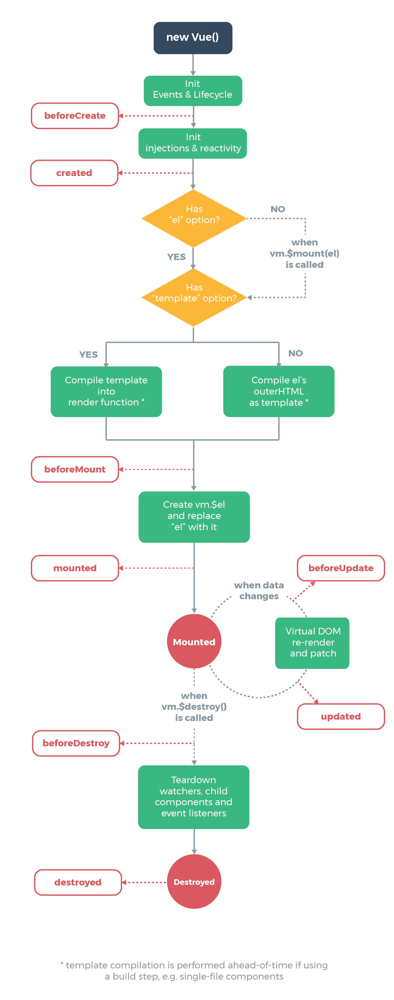

# Component Life Cycle

<div align="center">
  
</div>

* **beforeCreate() :**
This method is called synchronously after the Vue `instance has just been initialized`, before data observation and event/watcher setup.

* **created() :**
This method is called synchronously after the Vue instance is created. `Data observation, computed properties, methods and event callbacks have already been set up` at this stage but the mounting phase has not started yet.

* **beforeMount() :**
This method is called right before the component is mounted. So it is called `before the render method is executed`.

* **mounted() :**
This method is called after the component `has just been mounted`.

* **beforeUpdate() :**
This method is `called when the data changes, before the virtual DOM is re-rendered and patched`.

* **updated() :**
This method is called `after a data change causes the virtual DOM to be re-rendered and patched`.

* **activated() :**
This method is called when a keep-alive component is activated.
https://kr.vuejs.org/v2/api/#keep-alive
동적 컴포넌트를 감싸는 경우 <keep-alive>는 비활성 컴포넌트 인스턴스를 파괴하지 않고 캐시합니다. 컴포넌트가 <keep-alive>내에서 토글 될 때, activated와 deactivated 라이프사이클 훅이 그에 따라 호출됩니다.

```
<!-- 기본 사용 -->
<keep-alive>
  <component :is="view"></component>
</keep-alive>
```

* **deactivated() :**
This method is called when a keep-alive component is deactivated.

* **beforeDestroy() :**
This method is called right before a Vue instance or component is destroyed. `At this stage the instance is still fully functional`.

* **destroyed() :**
This method is called after a Vue `instance or component has been destroyed`. When this hook is called, all directives of the Vue instance have been unbound, all event listeners have been removed, and all child Vue instances have also been destroyed.

### 참고
https://medium.com/witinweb/vue-js-%EB%9D%BC%EC%9D%B4%ED%94%84%EC%82%AC%EC%9D%B4%ED%81%B4-%EC%9D%B4%ED%95%B4%ED%95%98%EA%B8%B0-7780cdd97dd4
